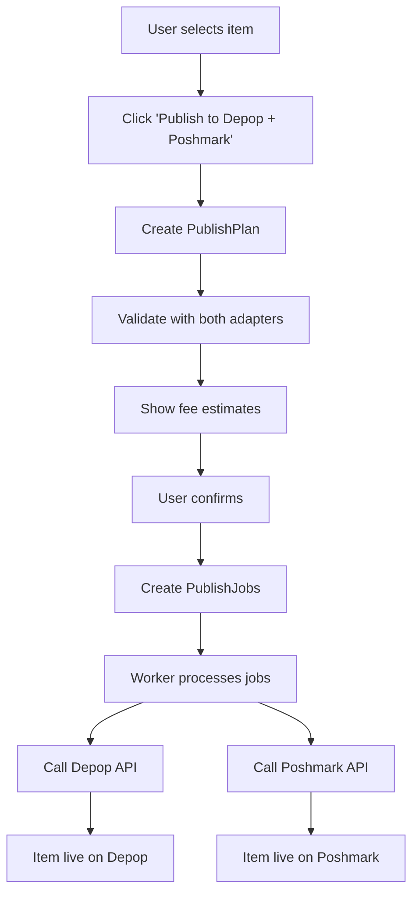

# Multi-Marketplace Integration Guide

## Overview

Your app uses a **pluggable adapter architecture** that allows you to publish listings to 10 different marketplaces from a single normalized data format. Each marketplace has different requirements, APIs, and fee structures, so the adapter system handles all the translation and complexity.

## How It Works

### 1. Normalized Listing Format

All items in your database use a **canonical format** that's marketplace-agnostic:

```typescript
interface NormalizedListing {
  itemId: string;
  title: string;
  description: string;
  priceCents: number;
  category: string;
  brand?: string;
  size?: string;
  color?: string;
  condition: 'NWT' | 'NWOT' | 'Excellent' | 'Good' | 'Fair' | 'Poor';
  conditionNotes?: string;
  defects?: Array<{ type, severity, location, description }>;
  images: Array<{ url, isPrimary, order }>;
  shippingPreset?: { carrier, serviceName, costCents, deliveryDays };
  tags?: string[];
  measurements?: Record<string, string>;
}
```

### 2. Marketplace Adapters

Each marketplace implements the `MarketplaceAdapter` interface:

```typescript
interface MarketplaceAdapter {
  validate(listing: NormalizedListing): Promise<ValidationResult>;
  mapToPayload(listing, account): Promise<MarketplacePayload>;
  create(payload, account, idempotencyKey): Promise<CreateListingResult>;
  update(externalListingId, payload, account): Promise<UpdateListingResult>;
  delete(externalListingId, account): Promise<DeleteListingResult>;
  parseError(rawResponse): NormalizedError;
  estimateFees(listing, account): Promise<FeeEstimate>;
}
```

### 3. Publishing Flow



---

## Depop Integration

### Depop Specifics

**API Type:** REST API (though Depop's API is not publicly documented - requires business partnership)

**Authentication:** OAuth 2.0 or API Key

**Strengths:**
- Gen Z/streetwear focused audience
- Strong community features
- Mobile-first platform
- Good for vintage, Y2K, streetwear

**Limitations:**
- **No public API** - You'll need to contact Depop for business API access
- Alternative: Use their web scraping (risky, against TOS)
- Alternative: Manual CSV export workflow

### How Depop Adapter Would Work

```typescript
// src/lib/marketplace/adapters/depop.ts

export class DepopAdapter extends BaseMarketplaceAdapter {
  readonly marketplace = 'depop';
  readonly displayName = 'Depop';
  readonly sandboxMode = false;

  readonly rateLimitPolicy = {
    maxRequestsPerSecond: 2,
    maxRequestsPerMinute: 60,
    maxRequestsPerHour: 1000,
    retryAfterOn429: true,
    circuitBreakerThreshold: 5,
    circuitBreakerTimeout: 600, // 10 minutes
  };

  async validate(listing: NormalizedListing): Promise<ValidationResult> {
    const errors = [];
    const warnings = [];

    // Depop Requirements
    if (listing.title.length > 65) {
      errors.push({
        field: 'title',
        message: 'Title must be 65 characters or less',
        suggestedFix: listing.title.substring(0, 62) + '...',
      });
    }

    if (listing.description.length > 1000) {
      errors.push({
        field: 'description',
        message: 'Description must be 1000 characters or less',
      });
    }

    if (listing.images.length > 4) {
      warnings.push({
        field: 'images',
        message: 'Depop supports up to 4 images',
        suggestedFix: 'Remove extra images',
      });
    }

    if (listing.images.length === 0) {
      errors.push({
        field: 'images',
        message: 'At least 1 image required',
      });
    }

    // Depop is mobile-first, so descriptions should be concise
    if (listing.description.length < 50) {
      warnings.push({
        field: 'description',
        message: 'Short descriptions may reduce trust',
        suggestedFix: 'Add measurements, condition details',
      });
    }

    // Depop prefers hashtags in description
    if (!listing.description.includes('#')) {
      warnings.push({
        field: 'description',
        message: 'Consider adding hashtags for discovery',
        suggestedFix: 'Add relevant #hashtags like #vintage #y2k #streetwear',
      });
    }

    return { valid: errors.length === 0, warnings, errors };
  }

  async mapToPayload(
    listing: NormalizedListing,
    account: MarketplaceAccount
  ): Promise<MarketplacePayload> {
    // Add hashtags based on tags
    let description = listing.description;
    if (listing.tags && listing.tags.length > 0) {
      const hashtags = listing.tags
        .slice(0, 5) // Max 5 hashtags
        .map(tag => `#${tag.replace(/\s/g, '')}`)
        .join(' ');
      description += `\n\n${hashtags}`;
    }

    // Add measurements if available
    if (listing.measurements) {
      description += '\n\nMeasurements:\n';
      Object.entries(listing.measurements).forEach(([key, value]) => {
        description += `${key}: ${value}\n`;
      });
    }

    return {
      description: description.substring(0, 1000),
      price: listing.priceCents / 100,
      category_id: this.mapToDepopCategory(listing.category),
      subcategory_id: listing.subcategory,
      brand: listing.brand || 'Vintage',
      size: this.mapToDepopSize(listing.size),
      condition: this.mapToDepopCondition(listing.condition),
      pictures: listing.images.slice(0, 4).map(img => img.url),
      variants: {
        national_shipping_cost: listing.shippingPreset?.costCents || 899, // $8.99 default
        quantity: 1,
      },
    };
  }

  async create(
    payload: MarketplacePayload,
    account: MarketplaceAccount,
    idempotencyKey: string
  ): Promise<CreateListingResult> {
    const url = 'https://webapi.depop.com/api/v2/products/';

    const response = await this.request('POST', url, {
      headers: {
        'Authorization': `Bearer ${account.accessToken}`,
        'Content-Type': 'application/json',
      },
      body: payload,
      idempotencyKey,
    });

    return {
      success: true,
      externalListingId: response.id,
      externalUrl: `https://www.depop.com/products/${response.slug}`,
      rawResponse: this.sanitizeResponse(response),
    };
  }

  async estimateFees(
    listing: NormalizedListing,
    account: MarketplaceAccount
  ): Promise<FeeEstimate> {
    // Depop fees: 10% marketplace fee + 2.9% + $0.30 payment processing
    const marketplaceFeePercent = 0.10;
    const paymentFeePercent = 0.029;
    const paymentFeeFixed = 30; // cents

    const marketplaceFeeCents = Math.round(listing.priceCents * marketplaceFeePercent);
    const paymentFeeCents = Math.round(listing.priceCents * paymentFeePercent + paymentFeeFixed);

    const totalFeeCents = marketplaceFeeCents + paymentFeeCents;
    const sellerPayoutCents = listing.priceCents - totalFeeCents;

    return {
      listingFeeCents: 0, // No listing fee
      finalValueFeeCents: marketplaceFeeCents,
      paymentProcessingFeeCents: paymentFeeCents,
      totalFeeCents,
      sellerPayoutCents,
      breakdown: [
        { name: 'Depop Fee', amountCents: marketplaceFeeCents, description: '10% of sale price' },
        { name: 'Payment Processing', amountCents: paymentFeeCents, description: '2.9% + $0.30' },
      ],
    };
  }

  private mapToDepopCategory(category: string): number {
    // Depop category IDs (examples)
    const map: Record<string, number> = {
      'polo': 1, // Tops
      'hoodie': 2, // Outerwear
      'shirt': 1, // Tops
      'pullover': 2, // Outerwear
      'bottoms': 3, // Bottoms
      'jersey': 4, // Sportswear
    };
    return map[category] || 1;
  }

  private mapToDepopSize(size?: string): string {
    if (!size) return 'ONE SIZE';
    // Depop uses S, M, L, XL, XXL
    const normalized = size.toUpperCase();
    if (['XS', 'S', 'M', 'L', 'XL', 'XXL'].includes(normalized)) {
      return normalized;
    }
    return 'ONE SIZE';
  }

  private mapToDepopCondition(condition: string): string {
    // Depop condition values
    const map: Record<string, string> = {
      'NWT': 'BRAND_NEW_WITH_TAGS',
      'NWOT': 'BRAND_NEW_WITHOUT_TAGS',
      'Excellent': 'GENTLY_USED',
      'Good': 'USED_GOOD',
      'Fair': 'USED_FAIR',
      'Poor': 'USED_POOR',
    };
    return map[condition] || 'GENTLY_USED';
  }

  parseError(rawResponse: any): NormalizedError {
    const message = rawResponse.error_message || rawResponse.message || 'Unknown error';
    const code = rawResponse.error_code || 'UNKNOWN';

    return {
      code,
      message,
      retryable: rawResponse.status >= 500 || code === 'RATE_LIMIT',
      rateLimitExceeded: code === 'RATE_LIMIT',
      retryAfterSeconds: rawResponse.retry_after || 60,
      rawError: this.sanitizeResponse(rawResponse),
    };
  }
}
```

### Depop API Access Options

Since Depop doesn't have a public API, you have 3 options:

1. **Business Partnership** (Recommended)
   - Contact Depop's business team for API access
   - Required for high-volume sellers
   - Email: business@depop.com

2. **CSV Bulk Upload** (Workaround)
   - Export items to CSV format
   - User manually uploads to Depop
   - Implement with `CSVExport` model
   ```typescript
   // Create CSV export for Depop
   const csv = await createDepopCSV(items);
   // User downloads and uploads to Depop
   ```

3. **Mobile App Automation** (Not recommended)
   - Use Appium/Selenium to automate Depop mobile app
   - Against TOS, risk of account ban
   - Only for personal use, not production

---

## Poshmark Integration

### Poshmark Specifics

**API Type:** REST API (Limited public access, requires partnership)

**Authentication:** OAuth 2.0

**Strengths:**
- Large user base (80M+ users)
- Built-in social features (parties, shares)
- Strong for fashion, luxury brands
- High-end market

**Limitations:**
- **Limited API access** - Requires Poshmark partnership
- API focused on large retailers/brands
- Manual sharing culture (requires time investment)
- 20% flat commission (highest of all platforms)

### How Poshmark Adapter Would Work

```typescript
// src/lib/marketplace/adapters/poshmark.ts

export class PoshmarkAdapter extends BaseMarketplaceAdapter {
  readonly marketplace = 'poshmark';
  readonly displayName = 'Poshmark';
  readonly sandboxMode = false;

  readonly rateLimitPolicy = {
    maxRequestsPerSecond: 1,
    maxRequestsPerMinute: 30,
    maxRequestsPerHour: 500,
    retryAfterOn429: true,
    circuitBreakerThreshold: 5,
    circuitBreakerTimeout: 900, // 15 minutes
  };

  async validate(listing: NormalizedListing): Promise<ValidationResult> {
    const errors = [];
    const warnings = [];

    // Poshmark Requirements
    if (listing.title.length > 80) {
      errors.push({
        field: 'title',
        message: 'Title must be 80 characters or less',
      });
    }

    if (listing.title.length < 15) {
      warnings.push({
        field: 'title',
        message: 'Short titles may reduce discoverability',
        suggestedFix: 'Add brand, size, color details',
      });
    }

    if (listing.description.length > 2000) {
      errors.push({
        field: 'description',
        message: 'Description must be 2000 characters or less',
      });
    }

    // Poshmark requires at least 1 image, supports up to 16
    if (listing.images.length === 0) {
      errors.push({
        field: 'images',
        message: 'At least 1 image required',
      });
    }

    if (listing.images.length > 16) {
      warnings.push({
        field: 'images',
        message: 'Poshmark supports up to 16 images',
        suggestedFix: 'Extra images will be ignored',
      });
    }

    // Poshmark requires brand
    if (!listing.brand) {
      errors.push({
        field: 'brand',
        message: 'Brand is required on Poshmark',
        suggestedFix: 'If unknown, use "Other" or "Vintage"',
      });
    }

    // Size is required
    if (!listing.size) {
      errors.push({
        field: 'size',
        message: 'Size is required on Poshmark',
      });
    }

    // Price minimum
    if (listing.priceCents < 300) {
      errors.push({
        field: 'price',
        message: 'Minimum price is $3.00 on Poshmark',
      });
    }

    // Poshmark takes 20% - warn if price is too low
    const payout = listing.priceCents * 0.8;
    if (payout < 500) {
      warnings.push({
        field: 'price',
        message: `After 20% fee, you'll receive $${(payout / 100).toFixed(2)}`,
        suggestedFix: 'Consider pricing higher or bundling',
      });
    }

    return { valid: errors.length === 0, warnings, errors };
  }

  async mapToPayload(
    listing: NormalizedListing,
    account: MarketplaceAccount
  ): Promise<MarketplacePayload> {
    // Build Poshmark-style description (encouraged to be detailed)
    let description = listing.description;

    // Add condition notes
    if (listing.conditionNotes) {
      description += `\n\n**Condition:** ${listing.conditionNotes}`;
    }

    // Add defects prominently (Poshmark culture values transparency)
    if (listing.defects && listing.defects.length > 0) {
      description += '\n\n**Please note the following:**\n';
      listing.defects.forEach(defect => {
        description += `• ${defect.description}`;
        if (defect.location) description += ` (${defect.location})`;
        description += '\n';
      });
    }

    // Add measurements (Poshmark shoppers expect detailed measurements)
    if (listing.measurements) {
      description += '\n\n**Measurements:**\n';
      Object.entries(listing.measurements).forEach(([key, value]) => {
        description += `• ${key}: ${value}\n`;
      });
    }

    // Add shipping info
    description += '\n\n📦 Ships within 1-2 business days\n💙 Pet-free, smoke-free home\n💸 Open to reasonable offers';

    return {
      title: listing.title.substring(0, 80),
      description: description.substring(0, 2000),
      cover_shot: {
        url: listing.images[0]?.url,
      },
      pictures: listing.images.slice(0, 16).map((img, idx) => ({
        url: img.url,
        position: idx,
      })),
      inventory: {
        size: this.mapToPoshmarkSize(listing.size),
        quantity: 1,
      },
      price_amount: {
        val: listing.priceCents,
        currency_code: 'USD',
      },
      original_price_amount: listing.priceCents, // MSRP if available
      department: this.mapToPoshmarkDepartment(listing.category),
      category: this.mapToPoshmarkCategory(listing.category),
      subcategory: listing.subcategory,
      brand: listing.brand || 'Other',
      condition: this.mapToPoshmarkCondition(listing.condition),
      color: listing.color,
      style_tags: listing.tags?.slice(0, 5) || [],
    };
  }

  async create(
    payload: MarketplacePayload,
    account: MarketplaceAccount,
    idempotencyKey: string
  ): Promise<CreateListingResult> {
    const url = 'https://api.poshmark.com/v1/listings';

    const response = await this.request('POST', url, {
      headers: {
        'Authorization': `Bearer ${account.accessToken}`,
        'Content-Type': 'application/json',
        'X-Poshmark-Idempotency-Key': idempotencyKey,
      },
      body: payload,
      idempotencyKey,
    });

    return {
      success: true,
      externalListingId: response.id,
      externalUrl: `https://poshmark.com/listing/${response.slug}-${response.id}`,
      rawResponse: this.sanitizeResponse(response),
      metadata: {
        needsSharing: true, // Poshmark culture - need to share listings
        shareUrl: response.share_url,
      },
    };
  }

  async estimateFees(
    listing: NormalizedListing,
    account: MarketplaceAccount
  ): Promise<FeeEstimate> {
    // Poshmark fees: 20% flat for sales over $15, or $2.95 flat fee for sales under $15
    const price = listing.priceCents / 100;

    let finalValueFeeCents: number;
    if (price >= 15) {
      // 20% commission
      finalValueFeeCents = Math.round(listing.priceCents * 0.20);
    } else {
      // $2.95 flat fee
      finalValueFeeCents = 295;
    }

    const totalFeeCents = finalValueFeeCents;
    const sellerPayoutCents = listing.priceCents - totalFeeCents;

    return {
      listingFeeCents: 0, // No listing fee
      finalValueFeeCents,
      paymentProcessingFeeCents: 0, // Included in commission
      totalFeeCents,
      sellerPayoutCents,
      breakdown: [
        {
          name: 'Poshmark Commission',
          amountCents: finalValueFeeCents,
          description: price >= 15 ? '20% of sale price' : '$2.95 flat fee (sales under $15)',
        },
      ],
    };
  }

  private mapToPoshmarkDepartment(category: string): string {
    // Poshmark departments
    return 'Men'; // or 'Women', 'Kids', etc.
  }

  private mapToPoshmarkCategory(category: string): string {
    const map: Record<string, string> = {
      'polo': 'Shirts',
      'hoodie': 'Sweaters',
      'shirt': 'Shirts',
      'pullover': 'Sweaters',
      'bottoms': 'Pants',
      'jersey': 'Athletic Apparel',
    };
    return map[category] || 'Shirts';
  }

  private mapToPoshmarkSize(size?: string): string {
    if (!size) return 'OS';
    // Poshmark uses standard sizes
    return size.toUpperCase();
  }

  private mapToPoshmarkCondition(condition: string): string {
    const map: Record<string, string> = {
      'NWT': 'NWT',
      'NWOT': 'NWOT',
      'Excellent': 'Like New',
      'Good': 'Good',
      'Fair': 'Fair',
      'Poor': 'Poor',
    };
    return map[condition] || 'Good';
  }

  parseError(rawResponse: any): NormalizedError {
    const error = rawResponse.error || rawResponse;
    const message = error.message || 'Unknown error';
    const code = error.error_code || 'UNKNOWN';

    return {
      code,
      message,
      retryable: rawResponse.status >= 500,
      rateLimitExceeded: code === 'RATE_LIMIT_EXCEEDED',
      retryAfterSeconds: error.retry_after || 120,
      rawError: this.sanitizeResponse(rawResponse),
    };
  }
}
```

### Poshmark API Access

**Getting Access:**
1. Apply for Poshmark Seller API access: https://poshmark.com/api
2. Requires business verification
3. Approval can take 4-6 weeks
4. Alternative: Use Poshmark's CSV bulk upload tool

---

## API Usage Example

### Multi-Marketplace Publishing Workflow

```typescript
// 1. User selects item and marketplaces
const item = await prisma.item.findUnique({ where: { id: 'item_123' } });

// 2. Create publish plan
const plan = await createPublishPlan({
  userId: 'user_456',
  itemId: 'item_123',
  marketplaces: ['DEPOP', 'POSHMARK', 'EBAY'],
});

// Returns:
// {
//   planId: 'plan_789',
//   consentToken: 'one_time_token',
//   validationResults: {
//     DEPOP: { valid: true, warnings: [...] },
//     POSHMARK: { valid: true, warnings: [...] },
//     EBAY: { valid: true, warnings: [...] }
//   },
//   estimatedFees: {
//     DEPOP: { totalFeeCents: 1320, sellerPayoutCents: 8680 },
//     POSHMARK: { totalFeeCents: 2000, sellerPayoutCents: 8000 },
//     EBAY: { totalFeeCents: 1950, sellerPayoutCents: 8050 }
//   },
//   expiresAt: '2025-10-13T17:00:00Z'
// }

// 3. Show confirmation UI to user with fee breakdown

// 4. User confirms and executes plan
const result = await executePublishPlan({
  consentToken: plan.consentToken,
});

// 5. System creates 3 PublishJobs (one per marketplace)
// 6. Worker processes jobs in parallel
// 7. Each adapter handles marketplace-specific API calls

// Result:
// {
//   published: ['DEPOP', 'EBAY'],
//   failed: ['POSHMARK'], // Example: Rate limit hit
//   results: {
//     DEPOP: {
//       success: true,
//       externalListingId: 'depop_xyz',
//       externalUrl: 'https://depop.com/products/...'
//     },
//     POSHMARK: {
//       success: false,
//       error: 'Rate limit exceeded',
//       retryable: true
//     },
//     EBAY: {
//       success: true,
//       externalListingId: 'ebay_abc',
//       externalUrl: 'https://ebay.com/itm/...'
//     }
//   }
// }
```

---

## Current Implementation Status

### ✅ Completed
- **Architecture:** MarketplaceAdapter interface ([src/lib/marketplace/adapter.ts](../src/lib/marketplace/adapter.ts))
- **Database schema:** PublishJob, PublishPlan, MarketplaceAccount models ([prisma/schema.prisma](../prisma/schema.prisma))
- **eBay Adapter:** Full production implementation ([src/lib/marketplace/adapters/ebay.ts](../src/lib/marketplace/adapters/ebay.ts))

### ⏳ Needs Implementation
- **Depop Adapter:** API access required, or implement CSV export workaround
- **Poshmark Adapter:** API access required, or implement CSV export workaround
- **Other adapters:** Grailed, Mercari, Shopify, Etsy, Facebook Marketplace, OfferUp, Vinted

### 📋 Next Steps

1. **Apply for API access:**
   - Depop: business@depop.com
   - Poshmark: https://poshmark.com/api
   - Grailed: support@grailed.com

2. **Implement CSV export workaround:**
   ```typescript
   // For marketplaces without API access
   export async function generateDepopCSV(items: Item[]) {
     const rows = items.map(item => ({
       title: item.title,
       description: item.description,
       price: item.suggestedPrice.medianCents / 100,
       brand: item.brand,
       size: item.size,
       condition: item.conditionSuggestion.grade,
       // ... more fields
     }));
     return createCSV(rows);
   }
   ```

3. **Create adapter factory:**
   ```typescript
   // src/lib/marketplace/factory.ts
   export function getAdapter(marketplace: Marketplace) {
     switch (marketplace) {
       case 'EBAY':
         return new EbayAdapter({
           clientId: process.env.EBAY_CLIENT_ID!,
           clientSecret: process.env.EBAY_CLIENT_SECRET!,
           sandboxMode: process.env.EBAY_SANDBOX_MODE === 'true',
         });
       case 'DEPOP':
         return new DepopAdapter();
       case 'POSHMARK':
         return new PoshmarkAdapter();
       // ... more adapters
     }
   }
   ```

4. **Test each adapter:**
   ```bash
   # Test Depop adapter (when API access available)
   npm run test:adapter -- depop

   # Test Poshmark adapter
   npm run test:adapter -- poshmark
   ```

---

## Fee Comparison

| Marketplace | Listing Fee | Commission | Payment Processing | Total (on $50 sale) | Seller Payout |
|-------------|-------------|------------|-------------------|---------------------|---------------|
| **Depop** | Free | 10% ($5.00) | 2.9% + $0.30 ($1.75) | $6.75 | $43.25 |
| **Poshmark** | Free | 20% ($10.00) | Included | $10.00 | $40.00 |
| **eBay** | Free* | 13.5% ($6.75) | 4% ($2.00) | $8.75 | $41.25 |
| **Grailed** | Free | 9% ($4.50) | 2.9% + $0.30 ($1.75) | $6.25 | $43.75 |
| **Mercari** | Free | 10% ($5.00) | 2.9% + $0.30 ($1.75) | $6.75 | $43.25 |

*eBay: First 250 listings free per month

**Key Takeaway:** Your multi-marketplace system should show users these fee estimates BEFORE they publish, so they can choose the most profitable marketplace for each item.

---

## Resources

- **eBay API Docs:** https://developer.ebay.com/
- **Depop Business:** business@depop.com
- **Poshmark API:** https://poshmark.com/api
- **Grailed Support:** support@grailed.com
- **Mercari API:** Invite-only, contact support

---

## Questions?

Read the [Vercel Deployment Guide](./VERCEL_DEPLOYMENT.md) for deployment instructions, or check the adapter interface implementation in [src/lib/marketplace/adapter.ts](../src/lib/marketplace/adapter.ts).
